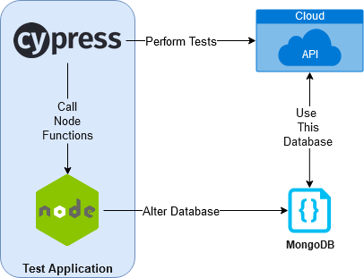

# Documentação do Cypress

## 1. O que é o Cypress e para que serve?

O Cypress é um poderoso framework de teste end-to-end (E2E) desenvolvido para aplicações web modernas. Sua principal finalidade é proporcionar uma experiência eficiente e amigável para automação de testes, permitindo que desenvolvedores e equipes de teste verifiquem suas aplicações de maneira eficaz.

## 2. Vantagens e desvantagens do Cypress em relação a outras ferramentas de teste.

### Vantagens:

- **Facilidade de Configuração e Uso:**
  - Instalação simples e API intuitiva.
- **Execução Rápida:**
  - Arquitetura eficiente permite testes síncronos, asserções precisas e depuração facilitada.
- **Recarregamento Automático (Hot Reloading):**
  - Ciclo de desenvolvimento mais rápido.
- **Interface Gráfica Poderosa:**
  - Visualização e interação durante a execução dos testes.
- **Captura de Vídeo e Screenshots:**
  - Análise pós-teste e compartilhamento de resultados.
- **Compatibilidade com Diversos Browsers:**
  - Suporte a Chrome, Firefox, Edge e Electron.
- **Waiting Automático:**
  - Eliminação do "inferno assíncrono".
- **Recursos Avançados:**
  - Spies, stubs e clocks para controle detalhado do teste.
- **Depuração Eficiente:**
  - Execução na mesma camada de desenvolvimento.

### Desvantagens:

- **Limitado a Aplicações Web:**
  - Especializado em testes para aplicações web.
- **Assíncrono Limitado:**
  - Desafios em operações assíncronas complexas.
- **Não Suporta Requisições Cross-Domain:**
  - Restrições em solicitações entre domínios diferentes.
- **Curva de Aprendizado Inicial:**
  - Para testadores com experiência prévia em outras ferramentas.
- **Dependência de JavaScript:**
  - Pode ser desafiador para equipes menos familiarizadas com essa linguagem.

## 3. Arquitetura do Cypress

O Cypress opera com uma arquitetura que executa comandos no mesmo loop de execução da aplicação, proporcionando acesso total ao frontend e backend. Consiste em:

- **Test Runner:**
  - Executa a GUI do Cypress para interação direta com os testes.
- **Cypress Server:**
  - Processo Node em segundo plano para gerenciar interações entre testes e navegador.
- **Navegador:**
  - Instância do navegador que executa aplicação e testes, controlada pelo Cypress Protocol.

Arquitetura do Cypress

 

## Quem usa o Cypress?

Normalmente são desenvolvedores ou engenheiros de QA que criam
aplicações web usando modernos frameworks JavaScript.

O Cypress permite que você escreva todos os tipos de testes:

- Testes end to end (ou testes de ponta-a-ponta)
- Testes de integração
- Testes de unidade

O Cypress pode testar tudo que é executado em um navegador.

## O ecossistema do Cypress

O Cypress consiste de um Test Runner (executor de testes) grátis, [open source](https://github.com/cypress-io/cypress),
[instalado localmente](../getting-started/installing-cypress.md) **e** um painel como serviço, 
para gravar seus testes.

- ***Primeiro:*** O Cypress torna fácil configurar e começar a escrever testes
todos os dias enquanto você cria sua aplicação localmente. *TDD no seu melhor!*
- ***Então:*** Depois de criar um conjunto de testes e integrar o Cypress ao
seu provedor de integração contínua (CI), nosso Painel como serviço pode gravar
suas execuções de teste. 
Você nunca terá que se perguntar: *por que isso falhou?*

## Funcionalidades

O Cypress vem totalmente pronto, com tudo que você precisa. Aqui está uma lista 
de coisas que ele pode fazer que nenhum outro framework de teste pode:

[//]: <> (TODO - Adicionar link log de comandos)

- **Viagem no tempo:** O Cypress tira *snapshots* enquanto seus testes 
são executados. Basta passar o mouse sobre os comandos no [log de comandos](https://docs.cypress.io/guides/core-concepts/test-runner.html#Command-Log)
para ver exatamente o que aconteceu em cada etapa.

[//]: <> (TODO - Adicionar link depure diretamente)

- **Depuração:** Pare de adivinhar por que seus testes estão falhando. 
[Depure diretamente](https://docs.cypress.io/guides/overview/why-cypress.html#Features) através de
ferramentas familiares como o Chrome DevTools. 
Nossos erros legíveis e *stack trace* tornam a depuração rápida.

[//]: <> (TODO - Adicionar link espera automaticamente)

- **Espera automatica:** Nunca adicione esperas ou sleeps aos seus testes. 
O Cypress [espera automaticamente](https://docs.cypress.io/guides/core-concepts/introduction-to-cypress.html#Cypress-is-Not-Like-jQuery)
por comandos e asserções antes de prosseguir. Chega de *async hell*.

[//]: <> (TODO - Adicionar link controle o comportamento)

- **Spies, Stubs, e Clocks:** Verifique e
[controle o comportamento](https://docs.cypress.io/guides/guides/stubs-spies-and-clocks.html) de funções,
respostas do servidor ou timers. A mesma funcionalidade que você adora no teste
de unidade está na ponta dos seus dedos.

[//]: <> (TODO - Adicionar link edge cases)

- **Controle de tráfego de rede:** Facilmente [controle, limite e teste 
*edge cases*](https://docs.cypress.io/guides/guides/network-requests.html)
sem envolver seu servidor. Você pode limitar o tráfego de rede como quiser.

- **Resultados consistentes:** Nossa arquitetura não usa o Selenium ou 
o WebDriver. Diga olá aos testes rápidos, consistentes e confiáveis que
são *flaky free* (livres de "fraquesas").

- **Screenshots e vídeos:** Veja capturas de tela tiradas automaticamente
em caso de falha ou vídeos de todo o seu conjunto de testes quando executado
a partir da interfáce de linha de comando.

- **Suporte entre navegadores:** Rode testes no Firefox e navegadores da família Chrome
(incluindo Edge e Electron) localmente e otimizado na *pipeline* de integração contínua.

## Configurando os testes

Não há servidores, drivers ou quaisquer outras dependências para instalar ou
configurar. Você pode escrever seu primeiro teste passando em 60 segundos.

## Escrevendo os testes

Testes escritos com o Cypress são fáceis de ler e entender. 

## Executando os testes

O Cypress é executado tão rápido quanto seu navegador pode renderizar conteúdo.

## Depurando os testes

Mensagens de erro legíveis ajudam você a depurar rapidamente. 

## Cypress Real World App

O Cypress torna rápido e fácil iniciar os testes e, quando você começa a testar seu aplicativo,
**muitas vezes se pergunta se está usando as melhores práticas ou estratégias escaláveis.**

Para guiar esse caminho, o time do Cypress criou a 
[Real World App (RWA)](https://github.com/cypress-io/cypress-realworld-app),
uma aplicação exemplo completa que demonstra testes com o **Cypress em cenários práticos e realistas.**

A RWA alcança cobertura de código total com testes ponta a ponta em vários navegadores e
tamanhos de dispositivo, mas também inclui testes de regressão visual, testes de API,
testes de unidade e os executa em um pipeline de CI eficiente. Use a RWA para **aprender,**
**experimentar, mexer e praticar** testes de aplicativos web com o Cypress.

O aplicativo vem com tudo que você precisa, 
[basta clonar o repositório](https://github.com/cypress-io/cypress-realworld-app)
e iniciar os testes. 

